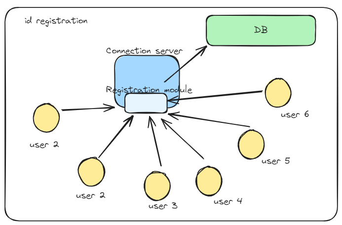
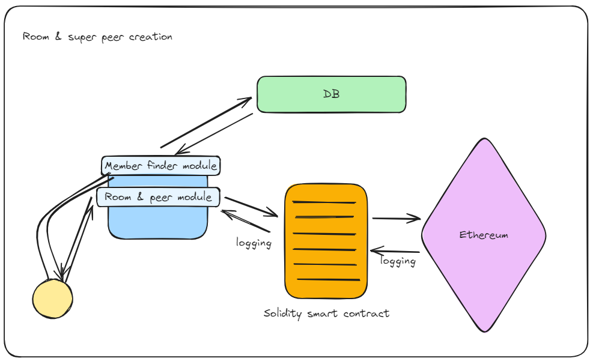
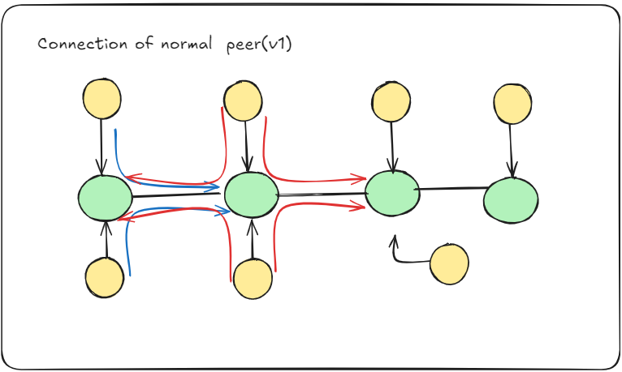
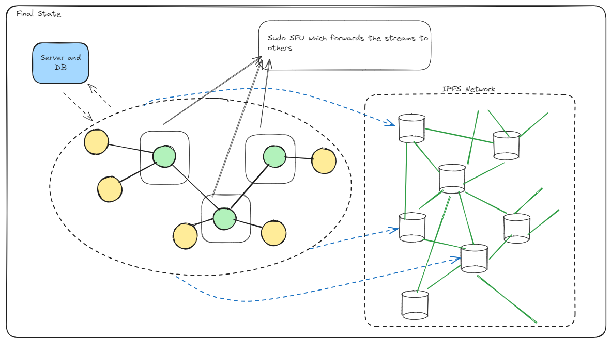

### Note : This is just a replica of my original [BlockMeet](https://github.com/deepsalunkhee/BlockMeet) for AWS Deployment
# 🚀 BlockMeet: The Decentralized Video Conferencing Revolution 🌐

Welcome to **BlockMeet**, where video conferencing meets decentralization! 🎉 Designed for secure, small-group communication, BlockMeet is perfect for private discussions, sensitive collaborations, and modern tech enthusiasts. Let’s dive in!  

---

## 🛠️ Features  
### 🎥 Live Video Conferencing  
Enjoy smooth and secure real-time video chats tailored for small, private groups. Built with **WebRTC**, BlockMeet delivers a seamless conferencing experience.  

### 🔐 Robust Authentication  
We’ve got your back with **JWT**-secured sign-up and sign-in processes. Your identity, your control.  

### 📜 Blockchain Logging  
Every action in your meetings is immutably logged using **smart contracts** written in **Solidity**, deployed on the **Polygon testnet**. Transparency and accountability redefined.  

### 📂 Decentralized File Storage  
Securely store meeting-related files with **IPFS**, integrated via **Pinata**. Share and access files with confidence, knowing they’re safe and decentralized.  

### ⚙️ Hydrocarbon-Inspired Architecture  
BlockMeet’s unique architecture ensures efficient data transfer through a **peer-super peer model**, keeping the experience smooth and private for small groups.  

---

## 🧰 Tech Stack  
We’ve blended the best tools and technologies to build BlockMeet:  
- **Frontend**: React ⚛️  
- **Backend**: Node.js + Express 🌐  
- **Database**: MongoDB 🍃  
- **Video Conferencing**: WebRTC 📹  
- **IPFS Integration**: Pinata 📡  
- **Blockchain**:  
  - Architecture: HardHat 🛠️  
  - Smart Contracts: Solidity 🧾  
  - Deployment: Polygon Testnet ⛓️  

---

## 🏗️ Layered Architecture  

BlockMeet is structured into a clean, modular architecture:  

### 📂 `apps/`  
1. **Client**  
   - Contains the front-end application built with **React**.  
   - Handles the user interface for video conferencing and file storage.  

2. **Server**  
   - The half-brains of the operation, powered by **Node.js** and **Express**.  
   - Manages:  
     - Meeting creation  
     - Adding participants  
     - Handling sign-ups and sign-ins  

3. **WebSocketServer**
   - The other half-Brain
   - This is where the Hydrocarbon stucture is formed 
   - The real-time communication hub for **WebRTC** signaling.  
   - Facilitates the exchange of ISP data and ensures seamless peer-to-peer connections.  

4. **Logging**  
   - Home to **Solidity smart contracts** built with the **HardHat👷🏽**.  
   - Logs meeting events immutably on the **Polygon blockchain**.  

---

## 🌟 How BlockMeet Works  

### 1️⃣ Setting Up a Meeting  
- Define participants before creating a meet.  
- The app calculates **super peers** using the formula:  
  `super_peer_count = ceil(participant_count / 3)`  

### 2️⃣ Joining the Meeting  
- Participants connect in the following order:  
  - The first participant becomes the **first super peer**.  
  - The second participant becomes the **second super peer**.  
  - Subsequent participants connect alternately to super peers in a round-robin manner.  

### 3️⃣ Data Transfer  
- **Super peers** act as relay nodes, transferring video/audio streams between participants.  
- This ensures efficient communication and keeps the architecture simple yet effective.  

### Why This Design?  
- Targeted for **small, private meetings**.  
- Optimized for confidentiality, security, and minimal lag.  
- Perfect for discussions where sensitive information is shared.  

---

## 🖼️ Visualizing BlockMeet  

---

## 🌟 Why Choose BlockMeet?  
- **Decentralized**: Your data is yours alone.  
- **Secure**: Blockchain logging ensures tamper-proof records.  
- **Scalable for Groups**: Designed for small, high-confidentiality meetings.  

---

## 🚀 Get Started  
Clone the repo, explore the code, and redefine video conferencing with BlockMeet! 🌐  

---

